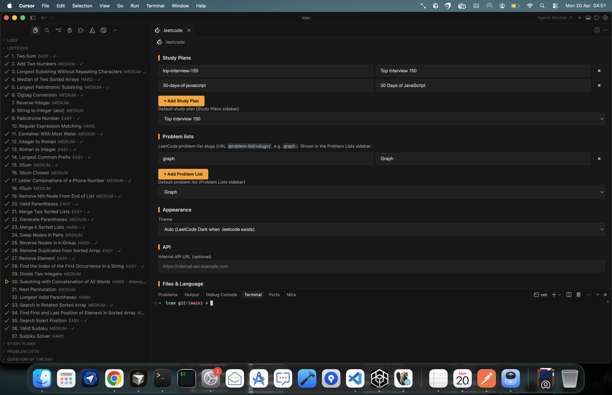
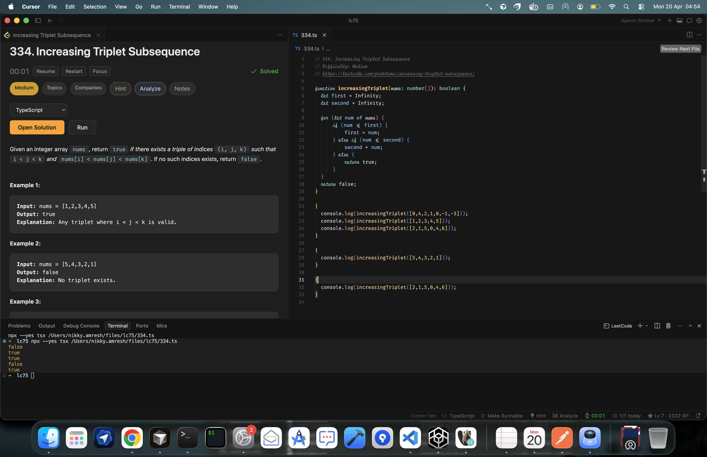
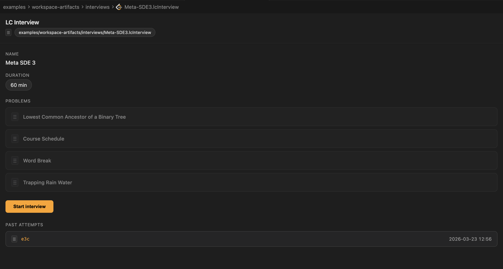
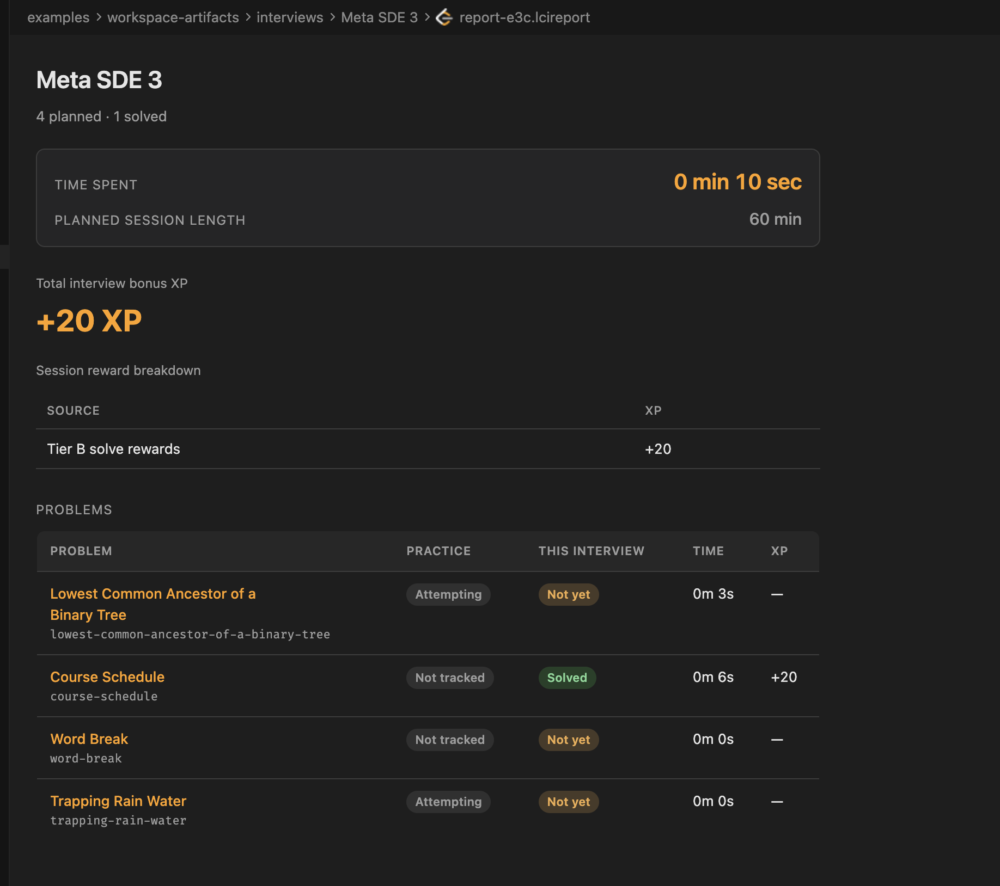
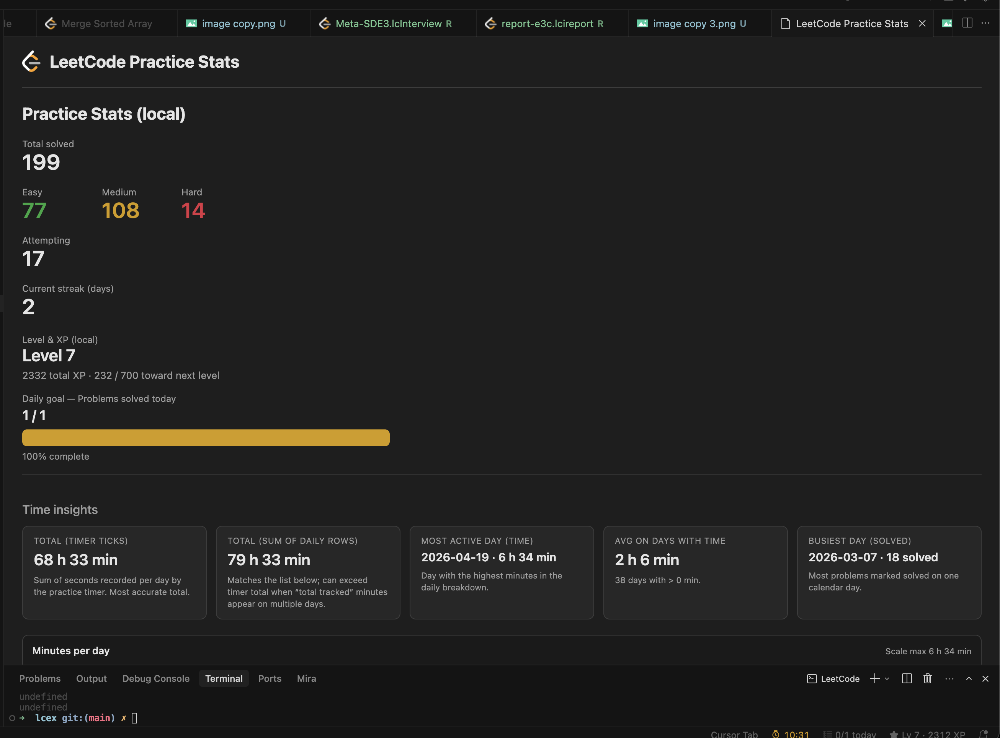
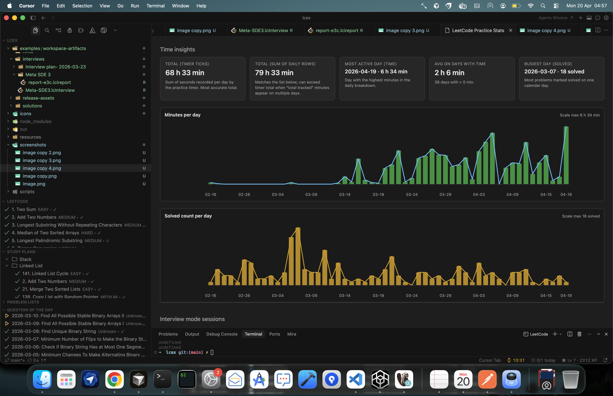
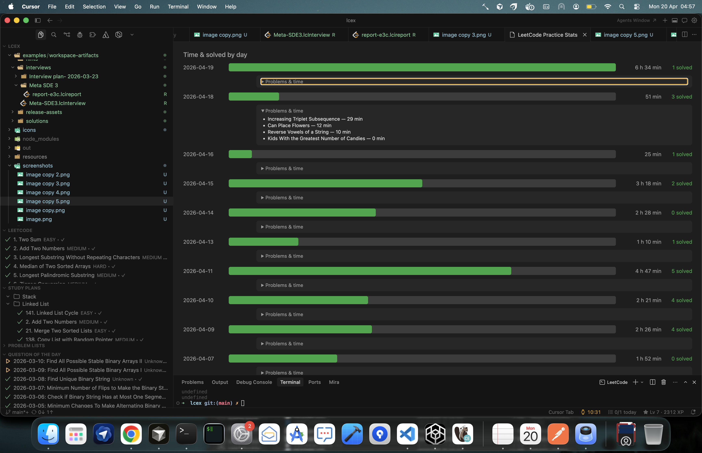
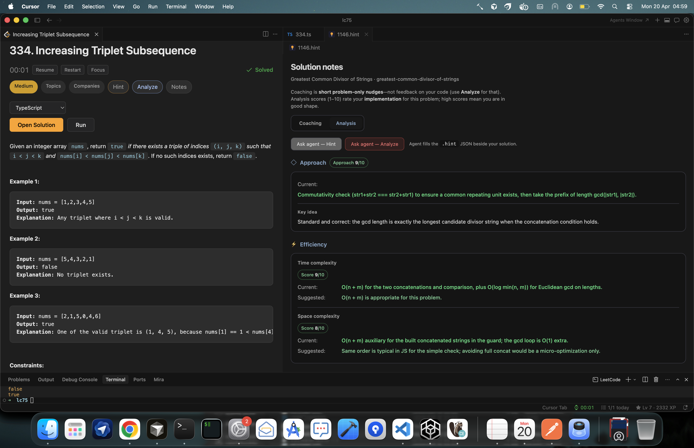

# LeetCode Practice

Practice LeetCode directly in VS Code or Cursor with problem browsing, template generation, run helpers, progress tracking, interview workflows, and optional cloud sync.

## Features

- Browse full LeetCode problemset, study plans, problem lists, and Question of the Day in sidebar views.
- Open problem statements in a rich webview and generate solution files in TypeScript, JavaScript, Python, or C++.
- Run examples inline and run the current solution in terminal.
- Track solved/attempting states, streaks, XP, level, and daily goals.
- Use ad hoc Interview Mode or planned `.lcInterview` sessions with `.lcireport` history.
- Use cloud sync (Firebase) to sign in, set username, and push/pull stats.
- Use Focus Mode for distraction-free solving and keep key status indicators visible.
- Trigger agent actions from editor (`Make Runnable`, `Hint`, `Explain My Code`).

## Screenshots

### LeetCode Config Editor (`.leetcode`)


### Problem View + Run in Terminal


### LC Interview Plan Editor (`.lcInterview`)


### LC Interview Report (`.lcireport`)


### Stats Overview


### Stats Charts (Minutes/Solved Trends)


### Time & Solved Breakdown by Day


### Solution Notes + Hint/Analyze Actions


## Repository Examples (Moved from Root)

To keep the extension repository clean, sample practice/interview artifacts are stored under:

- `examples/workspace-artifacts/solutions/`
- `examples/workspace-artifacts/interviews/`
- `examples/workspace-artifacts/hints/`
- `examples/workspace-artifacts/release-assets/`

These files are examples only (manual testing, demo data, and history snapshots). They are not required for extension runtime.

### Included example artifacts

- **Sample solution files:** numeric slugs and named files such as `two-sum.ts`, `2762.py`, `merge-sorted-array.ts`
- **Interview plans:** `.lcInterview` files such as `Meta-SDE3.lcInterview`
- **Interview reports:** `.lcireport` snapshots from past runs
- **Hint notes:** `.hint` files used by the hint/analysis flow
- **Legacy release outputs:** archived `.vsix.zip` / `.png.zip` and local export files

### Why this structure

- Keeps project root focused on extension source/config only
- Makes examples discoverable in one place
- Prevents confusion between production code and personal practice files

## Requirements

- VS Code or Cursor `1.85+`
- Node.js (for TS/JS execution)
- Python 3 (optional, for Python solutions)

## Quick Start

1. Open your workspace in VS Code/Cursor.
2. Create a `.leetcode` file in the workspace root.
3. Run `LeetCode: Sign In`.
4. Open the LeetCode sidebar and choose a problem.
5. Create a solution file, solve, and run using `LeetCode: Run Examples` or `LeetCode: Run in Terminal`.

## Commands

Major commands:

- `LeetCode: Open/Create Problem`
- `LeetCode: Open Question of the Day`
- `LeetCode: Run Examples`
- `LeetCode: Run in Terminal`
- `LeetCode: Sign In` / `LeetCode: Sign Out`
- `LeetCode: Refresh Problems`
- `LeetCode: View Stats`
- `LeetCode: Set Daily Goal`
- `LeetCode: Interview Mode — Start` / `LeetCode: Interview Mode — Stop`
- `LeetCode: Generate LC Interview (AI)`
- `LeetCode: Open LC Interview Report…`

Cloud sync commands:

- `LeetCode: Sign in to Cloud Sync`
- `LeetCode: Sign out of Cloud Sync`
- `LeetCode: Set LeetCode username`
- `LeetCode: Push stats to cloud now`
- `LeetCode: Pull stats from cloud`

## Extension Settings

This extension contributes the following settings:

- `leetcodePractice.defaultDirectory`
- `leetcodePractice.fileNamePattern`
- `leetcodePractice.language`
- `leetcodePractice.problemViewMode`
- `leetcodePractice.suppressAiTabOnSolve`
- `leetcodePractice.suppressAiTabWorkspaceWide`
- `leetcodePractice.internalApiUrl`
- `leetcodePractice.activeStudyPlan`
- `leetcodePractice.activeProblemList`
- `leetcodePractice.activeListSource` (deprecated)
- `leetcodePractice.studyPlans`
- `leetcodePractice.problemLists`
- `leetcodePractice.showProblemLists`
- `leetcodePractice.leetcodeUsername`

## Workspace Config (`.leetcode`)

Use `.leetcode` for workspace-specific behavior (study plans, lists, language, prompts, and visibility toggles).

```json
{
  "studyPlans": [{ "slug": "top-interview-150", "name": "Top Interview 150" }],
  "problemLists": [{ "slug": "graph", "name": "Graph" }],
  "activeStudyPlan": "top-interview-150",
  "activeProblemList": "graph",
  "language": "typescript",
  "fileNamePattern": "id",
  "defaultDirectory": ".",
  "internalApiUrl": ""
}
```

## Cloud Sync (Live)

Cloud sync uses Firebase auth + Firestore:

1. Run `LeetCode: Sign in to Cloud Sync`
2. Run `LeetCode: Set LeetCode username`
3. Use push/pull commands to sync stats

If you host your own auth page, keep config aligned between:

- `src/modules/cloud/firebaseApp.ts`
- `auth-page/index.html`

## Development

- `npm install`
- `npm run typecheck`
- `npm run bundle`
- `npm run compile`
- `npm run watch`
- `npm test`
- `npm run package`
- `npm run install-extension`

## Release Notes

### 0.1.0

- Initial public/live release of LeetCode Practice.

## License

MIT
